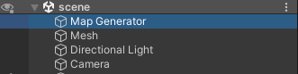
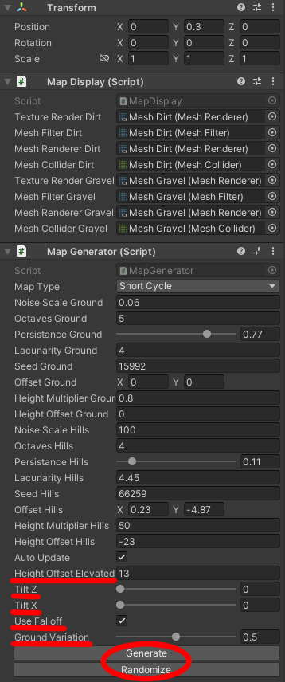

# Environment generation for mobile robotic simulation

---

This project aims to generate a short loading cycle environment in Unity. This environment should be able to
have special properties such as size, tilt, hill height, ground irregularities and different frictions. 
The main function is that it is possible to generate a new random terrain at will or modifying an already existing one. 
It will primarily be used for machine learning but can be attributed to other areas as well.

This project is made in Unity version `2021.2.8f1`. If you have any problems then try using this version.

---

## Setup

### Open Project

1. Pull down the project.

2. Open the project in Unity and navigate to `Assets -> Scenes` and open the file `scene`.

3. In the scene open the object `Map Generator`.

4. In the `Map Generator` field you can generate or randomize a new environment. 
You can also change the values of how it should look but we recommend that you only change the following fields:

`Height Offset Elevated`, `Tilt Z`, `Tilt X`, `Use Falloff` and `Ground Variation`.

---

## Export Environment

1. If you want to export the environment to an .obj file you have to use the `Scene OBJ Exporter` 
package already in the project (https://assetstore.unity.com/packages/tools/utilities/scene-obj-exporter-22250).

2. You then have to navigate to `File -> Export -> Wavefront OBJ`. There you simply press `Export`
and choose where to export. 

OBS! If the environment does not contain any colour then try first selecting the mesh objects in
the scene and do the above step. You also have to select the `Only Selected Objects`.

---

## Import Robot

If you want to import an URDF machine then use the package `URDF importer`. You can find
instructions here: `https://github.com/Unity-Technologies/URDF-Importer`.

---

## Automate the process

If you want to be able to run this process in the console then do the follwing instructions.

1. Navigate to `C:\Program Files\Unity\Hub\Editor\2021.2.8f1\Editor`.

2. Enter in the following command: `.\Unity.exe -batchmode -quit -projectPath 
"<PROJECTPATH>" -executeMethod GenerateEnvironment.StartGeneration -heightOffsetElevated <HEIGHT_OF_HILLS> -tiltZ <TILT_Z_AXLE> -tiltX <TILT_X_AXLE> -useFalloff <USEFALLOFF>`.
Height and tilt should have the format ("13.0" for example) while the falloff should have the format ("true" or "false").

An example is `.\Unity.exe -batchmode -quit -projectPath "C:\Users\student\Documents\Environment generation for mobile robotic simulation" -executeMethod GenerateEnvironment.StartGeneration 
-heightOffsetElevated 13.0 -tiltZ 0 -tiltX 0 -useFalloff true`.

3. The environment gets exported to the directory that was last exported to.

---